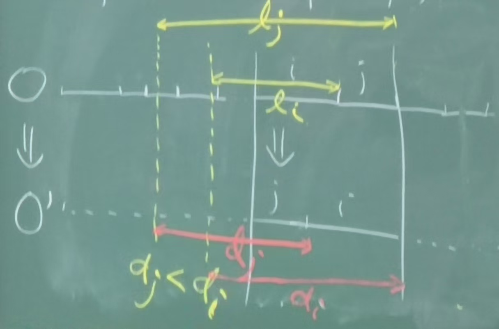

# 2

## DFS

### Notation

- white node: unexplored
- gray: we are exploring it
- black: finished
- $u.d$: discovery time
- $u.f$: finishing time

### Parenthesis theorem

### Topological Sort of a DAG (Directed Acyclic Graph)

#### One way

- Repeat: delete the node with no outgoing edges.
- $O(|V|+|E|)$

#### Another way: DFS

1. Call `DFS(G)` and compute $v.f$ for all $v \in V$.
2. as each $v$ is finished, insert it onto the front of a linked list.
3. return the linked list of vertices. (decreasing order of finishing time)

- LM: $G$ is a DAG iff `DFS(G)` yields no back edges.
- LM: Topo Sort Algo is correct
- Proof: if suffices to show that if $u \to v$ then $v.f < u.f$.
- Consider the time we explorer edge $(u,v)$.
  - $v$ is black $\implies$ $v.f<u.f$.
  - $v$ is white $\implies$ by white path THM, $v$ is a descendant of $u$, by parenthesis THM, $v.f < u.f$.
  - $v$ is gray $\implies$ $(u, v)$ is a back edge $\implies$ $G$ is not DAG.

### Strongly Connected Components

- Definition: A SCC is a maximal set of vertices such that every pair of vertices is reachable from each other.
- A directed graph can be partitioned into SCCs.
- After contracting all SCC, the resulting graph is a DAG.
- Think di-graph as a DAG of SCCs.

#### Kosaraju's Algorithm

1. `DFS(G)` compute $u.f$ for all $u \in V$.
2. Compute $G^T$ (reverse all edges).
3. `DFS(GT)` but in the main loop (the loop that we pick white vertices), consider the vertices in decreasing order of $u.f$.
4. Each tree in the second DFS forest is a SCC.

- Source component: a component with no incoming edges (after condensation).
- Sink component: a component with no outgoing edges (after condensation).
- THM: if we start DFS from a sink comp, DFS will visit precisely all nodes in that comp. (proof by white-path THM)
- LM A: the node with largest $v.f$ belongs to a source comp in $G$. (also a sink comp in $G^T$)
- LM B: suppose $C$ and $D$ are two SCCs, $D$ is reachable from $C$, $v$ is the first visited node in C. Then $v.f > u.f$ for all $u \in D$.
  - Proof:
    1. $v$ is first discovered by DFS (in $C \cup D$), by white-path THM, all nodes in $C \cup D$ are descendants of $v$.
    2. $u \in D$ is the first discovered node. There's no white path from $u$ to $v$, so $v$ is not a descendant of $u$.
- LM B $\implies$ LM A

## Greedy Algorithms

### Interval Scheduling

- Goal: maximize #jobs we can process. (one job at a time)
- Greedy: select the job that finishes earliest.
- Proof: exchange argument. (prove our sol is not worse than a optimal sol)
  - Sol: some intervals: $i_1, i_2, \ldots, i_k$
  - Opt: some intervals: $j_1, j_2, \ldots, j_{k'}$
  - Claim: $f(i_1) \le f(j_1)$
  - Claim: $f(i_r) \le f(j_r)$
    - Proof of claim: by induction.
    - Assume claim is true for $r-1$. $f(i_{r-1}) \le f(j_{r-1})$.
    - Suppose for contradiction $f(i_r) > f(j_r)$.
    - By greedy rule this is impossible since we can exchange $i_r$ and $j_r$.
  - If $k' > k$, we can add $j_{k+1}, \ldots, j_{k'}$ to our sol, this contradicts the greedy rule.
- Interval graph: vertices are intervals, edges are overlapping intervals.
- Max independent set problem: find an IS of max size.
  - Original problem is NP-hard.
  - On interval graphs it's not.

### Schedule to minimize lateness

- Input: $n$ jobs, each job $i$ has a length $t_i$ and deadline $d_i$, if a job $i$ is finished after $d_i$, the lateness of job $i$ is $l_i = f_i - d_i$.
- Goal: find a schedule s.t. $\operatorname{max}_i l_i$ is minimized.
- Greedy: sort the jobs in increasing order of $d_i$.
- Proof:
  - Def (inversion): consider a schedule $A$, $(i, j)$ is an inversion if $i$ is scheduled before $j$ but $d_i > d_j$.
  - w.l.o.g. assume all $d_i$s are distinct.
  - Suppose $O$ is some optimal scheduling.
  - Claim: if $O \neq A$, there is an inversion $(i, j)$ in $O$, s.t., $i$ is scheduled before $j$ in $O$.
  - If there is such an inv $(i, j)$, if we swap $i, j$, we get a schedule with lateness $\le O$.

