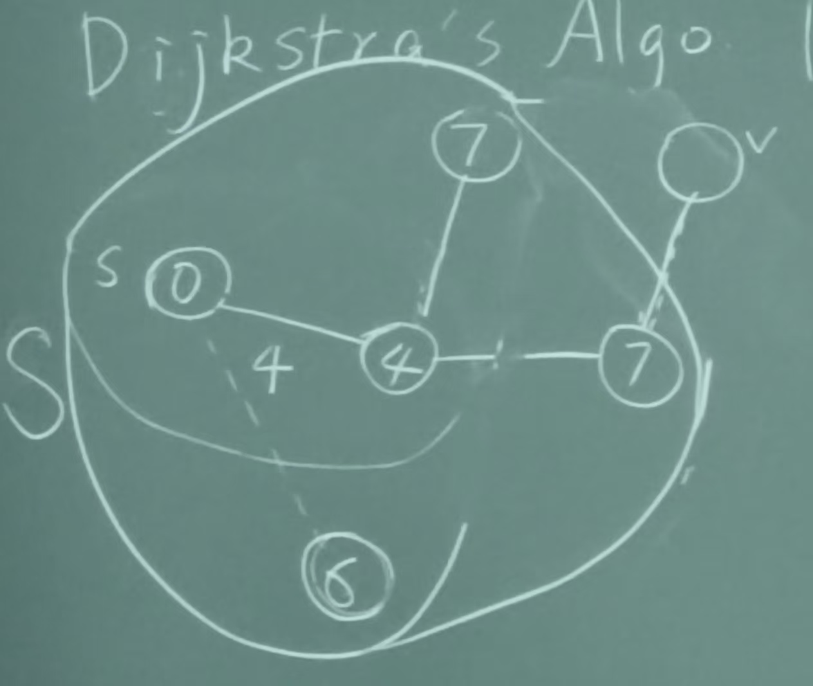
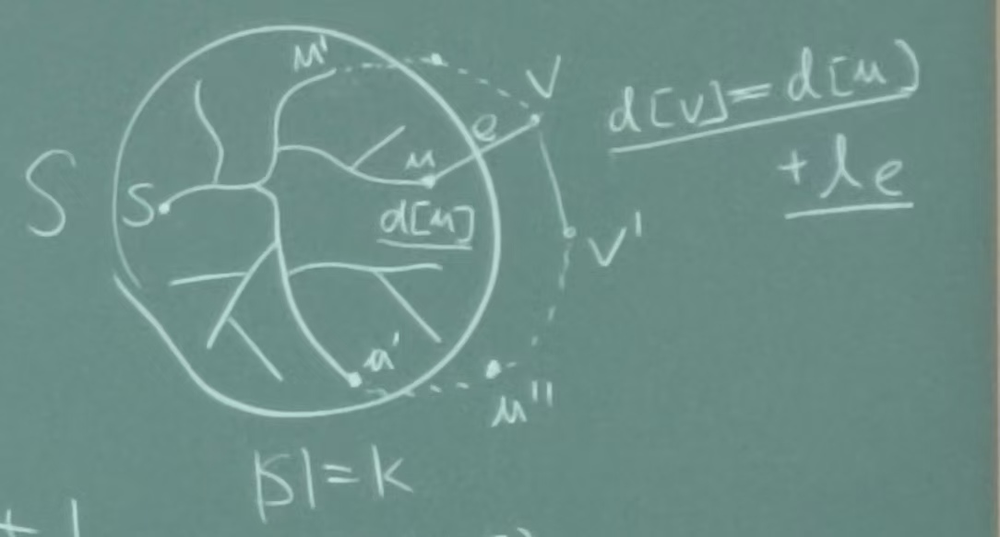
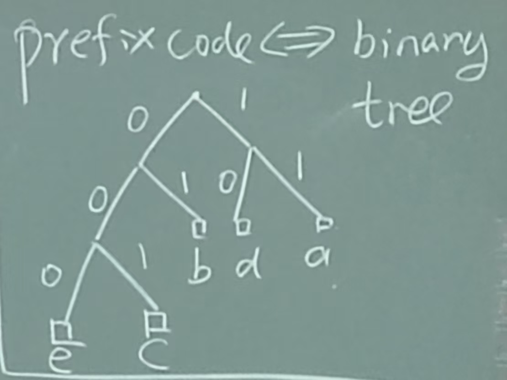
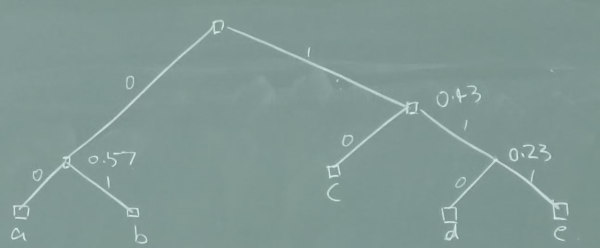

# 3

## Shortest Path Problem (Single Source)

- all edge weights $\ge 0$.
- the algorithm will find a shortest-path tree with root $s$.

### Dijkstra's Algorithm

- init $S=\{\}$
- repeat
  - choose $v \notin S$ s.t. $\operatorname{min}d[u] + l_e$.
  - ($e=(u,v)$ and $u \in S$)
  - add $v$ to $S$
  - until $S=V$

- THM: Dijkstra's algorithm produces the shortest path tree.
  - Proof: induction on $|S|$.
  - Base case: $|S|=1$.
  - Induction hypothesis: assume true for $|S|=k$.
  - Induction step: we want to show for $|S|=k+1$.
    - Case 1: shortest $s\to v$ is of the form $s\to u'\to v$.
    - Case 2: shortest $s\to v$ is of the form $s\to u'\to u''\to v'\to v$.

  - 

- what if some edge weights $<0$ ?
  - Bellman-Ford algorithm.

## Minimum Spanning Tree (Undirected)

- Assume all weights are distinct.

### Prim's Algorithm

- init $S=\{s\}$, $T=\{\}$.
- repeat
  - choose $v \notin S$ and $u \in S$ s.t. $(u,v)$ is of min weight.
  - add $v$ to $S$, add $(u,v)$ to $T$.
  - until $S=V$.

### Kruskal's Algorithm

- sort all edges in increase order of their weights and insert them one by one.
- if the edge creates a cycle we discard it.

- reverse deletion: sort all edges in decrease order of their weights and delete them one by one.
- if the edge disconnects the graph we discard it.

### Correctness

- LM: $e=(u, w)$ is the min-cost edge in cut $E(S, V-S)$, then every MST contains $e$.
  - Proof: by contradiction.
  - Suppose some MST $T$ does not contain $e$.
  - But $T$ must contain some path $e' \in E(S, V-S)$.
  - Need to show $T'= T - e' + e$ is also a tree. (not clear)
  - Add $e$ to $T'$, we get a cycle $C$.
  - There must be an edge $e''$ in $C$ s.t. $e'' \in E(S, V-S)$.
  - $T'' = T' - e'' + e$ is a tree.
  - (we need to choose this special $e''$ to finish proof)

## Huffman Codes

- $S$: set of symbols.
- code: $S \to \{0, 1\}^*$.
- prefix code: $r: S \to \{0, 1\}^*$ s.t. for any $x, y \in S, x\neq y$, $r(x)$ is not a prefix of $r(y)$.
  - prefix code is easy to decode, otherwise need a global decoder.
  - prefix code $\leftrightarrow$ binary tree.
  - 
- $n$ letters, $O(\log n)$ $0, 1$.
- frequency of letters: $f: S \to \mathbb{N}$, $\sum_{x\in S} f(x) = 1$.
- encoding length: $L(r) = \sum_{x\in S} f(x) \cdot |r(x)|$.
- Goal: find a prefix code $r$ s.t. $L(r)$ is minimized.
- C.Shannon: $L(r) \ge H(f)$, where entropy $H(f) = -\sum_{x\in S} f(x) \log f(x)$.
- Huffman's algorithm
  - e.g. $f(a) = 0.32, f(b) = 0.25, f(c) = 0.2, f(d) = 0.18, f(e) = 0.05$.
  - choose two least frequent letters, merge them into a new letter.
  - repeat until only one letter left.
  - 
- LM: There is an optimal tree $T^*$ in which the two least frequent letters are assigned to leaves that are as deep as possible in $T^*$.
