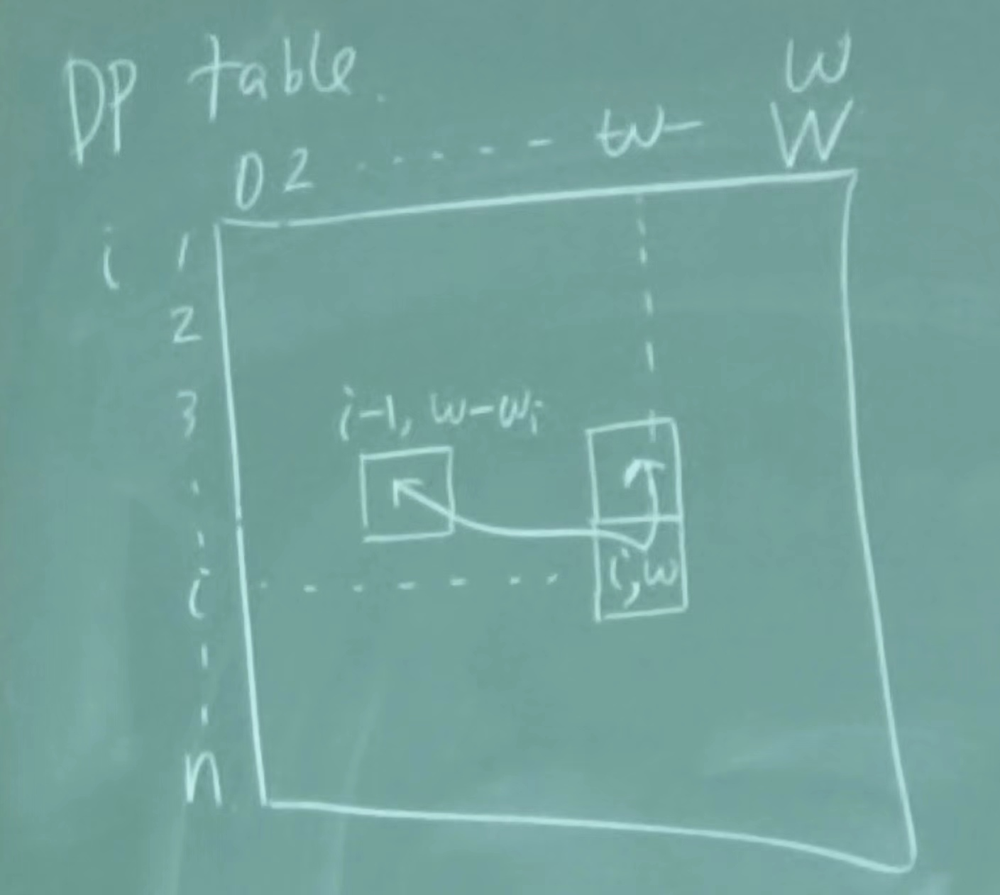
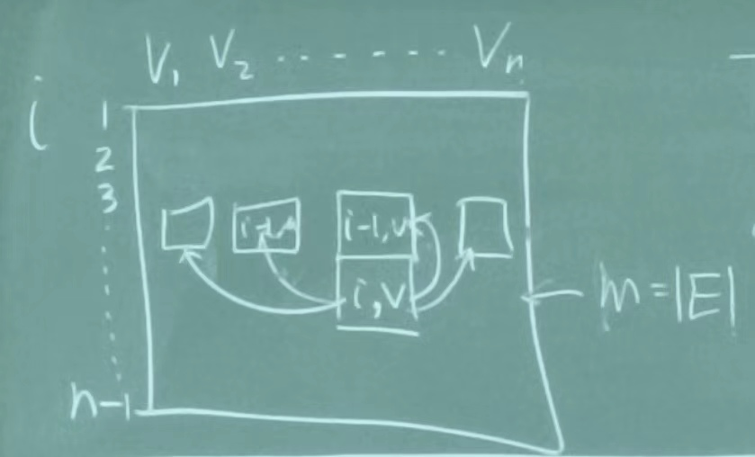

# Dynamic Programming (DP)

- exp -> poly

## Weighted Interval Scheduling

- Description: Given a set of intervals, each with a weight, find the maximum weight subset of mutually compatible intervals.
- Key 1: the optimal solution depends on the optimal solution of a smaller instance.
  - Jobs are sorted (by finish time) $\{1, 2, \cdots, n\}$.
- DP recursion: $OPT(j) = \max\{OPT(j-1), w_j + OPT(p(j))\}$, where $p(j)$ is the largest index $i < j$ such that interval $i$ is compatible with interval $j$.
- Key 2: memorizing the recursion
  - DP table: $OPT[0], OPT[1], \cdots, OPT[n]$
- Running time: $O(n\log n)$
- we can also trace back the optimal subset of jobs easily.

## Segmented least square

- Given $n$ points $(x_1, y_1), \cdots, (x_n, y_n)$, find $y=ax+b$ minimize $\sum_{i=1}^n (y_i - (ax_i+b))^2$.
- Exact solution:
  $$a = \frac{n\sum x_i y_i - \sum x_i \sum y_i}{n\sum x_i^2 - (\sum x_i)^2}$$
  and
  $$b = \frac{\sum x_i^2 \sum y_i - \sum x_i \sum x_i y_i}{n\sum x_i^2 - (\sum x_i)^2}$$
- Error: $C\cdot (\#\text{segments})+\sum_\text{segment i}\text{error}(\text{segment i})$.
- $OPT(j)$: optimal sol. for points $1, 2, \cdots, j$.
- DP recursion: $OPT(j) = \min(OPT(k-1) + \text{err}(k, j)) + C, 1\le k<j$.
  - $\text{err}(k, j)$: error for segment $k, k+1, \cdots, j$.

## Subset Sum & Knapsack

- $n$ items with weights $w_1, w_2, \cdots, w_n$, $W$: target.
  - Question: whether $\exists \text{subset} S \subseteq [n]$ s.t. $\sum_{i\in S} w_i = W$.
- Knapsack: $n$ items with weights $w_1, w_2, \cdots, w_n$ and values $v_1, v_2, \cdots, v_n$, $W$: target.
  - Goal: find a subset $S \subseteq W$ s.t. $\sum_{i\in S} w_i \le W$ and $\sum_{i\in S} v_i$ is maximized.
  - $w, W\in \mathbb{N}$, solve this in $\text{poly}(n, W)$ time.
  - $OPT(i, w)$: optimal solution for subproblem $\{1, 2, \cdots, i\}$ with capacity $w$.
  - DP recursion:
  $$OPT(i, w) = \max\begin{cases}
    OPT(i-1, w) \\
    OPT(i-1, w-w_i) + v_i & \text{if } w_i \le w
  \end{cases}$$
  - 
- Running time: $O(nW)$, we say here $\text{poly}(n, W)$ is pseudo-polynomial time.
  - Strongly poly-time: $O(n^c)$ for some constant $c$.
  - Weakly poly-time: $O(n\log W)$.
  - Pseudo-poly-time: $O(nW)$.

## Shortest Path (with possibly negative weights)

### Bellman-Ford Algorithm

- $OPT(i, v)$: min-cost $v\to t$ path that uses at most $i$ edges.
- DP recursion:
  $$OPT(i, v) = \min\begin{cases}
    OPT(i-1, v) \\
    \min_{(u, v)\in E}\{OPT(i-1, u) + C_{vu}\}
  \end{cases}$$
- 
- Time: $O(nm)$, Space: $O(n)$, where $n=|V|, m=|E|$.
- Bellman-Ford
  - $M[v] = \min(M[v], \min_{u\in V}\{M[u] + C_{vu}\})$.
  - Ob: after $i$-th iteration, $M[v] \le OPT(v, i)$.
  - $M[v]$ can use some **updated** values to update itself.
- Find a shortest path
  - maintain an array $First[v]$.
  - when we update $M[v]$ using $M[u] + C_{vu}$, set $First[v] = u$.
- Pointer graph $P$: $v \to First[v]$
- LM: if $P$ contains a cycle $C$ (at any stage), then $\text{cost}(C)<0$.
  - Proof:
  - Always true: if $First[v] = u$, $M[v] \le C_{vu} + M[u]$. ($M[u]$ may be updated)
  - Let $C$ be a cycle in $P$. $v_1 \to v_2 \to \cdots \to v_k \to v_1$.
  $$\begin{cases}
    M[v_1] &\ge C_{v_1v_2} + M[v_2] \\
    \cdots \\
    M[v_{k-1}] &\ge C_{v_{k-1}v_k} + M[v_k] \\
    M[v_k] &> C_{v_kv_0} + M[v_0]
  \end{cases}$$
- LM: Suppose $G$ has no negative cycle. Consider $P$ at the end of the algorithm. The $v\to t$ path in $P$ is the shortest $v\to t$ path in $G$.
  - Proof:
  - $P$ has no cycle from last LM.
  - Suppose there exists a shortest path $First[v] = u$, then $M[v] = C_{vu} + M[u]$.
  - but we know the value of $M[v]$ is the optimal value.
  - so $First[v]$ is the first node on the shortest path from $v$ to $t$.
  - we can trace back the shortest path from $t$ to $v$.
