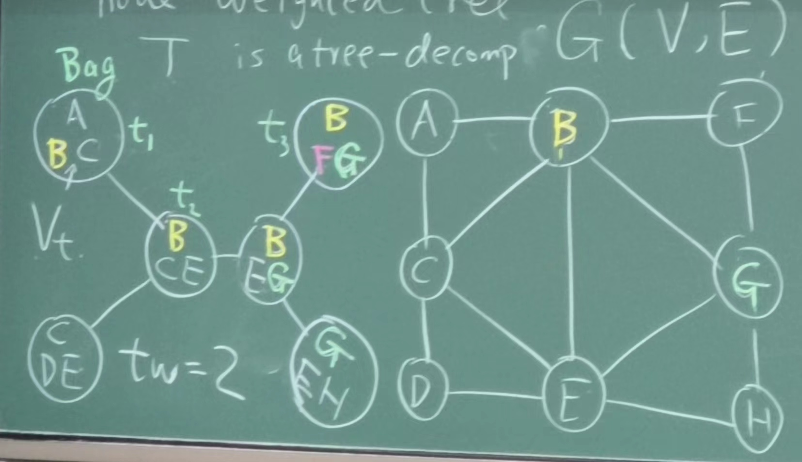
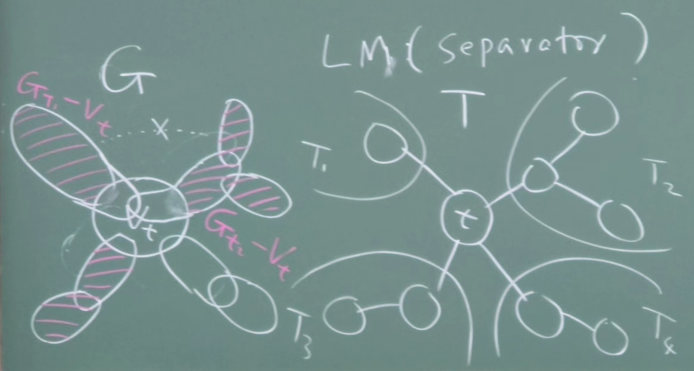
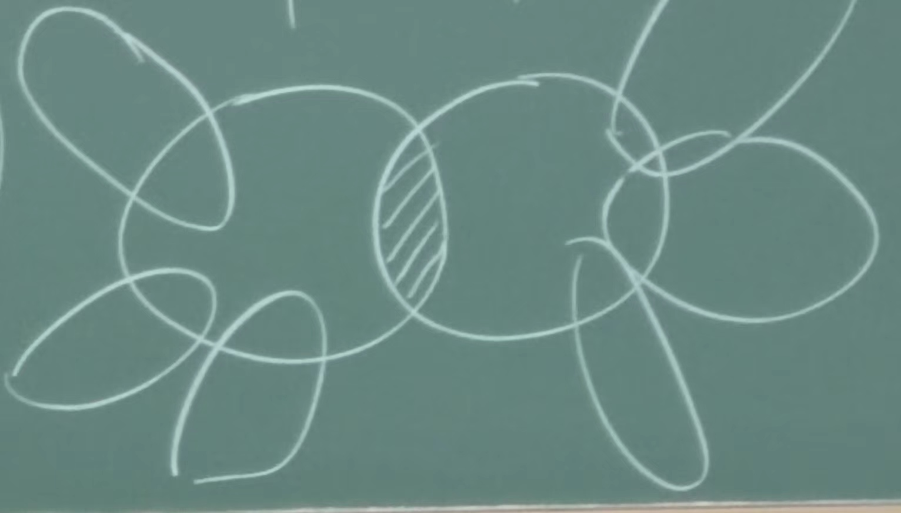
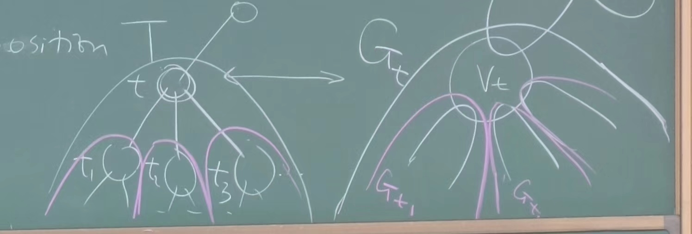
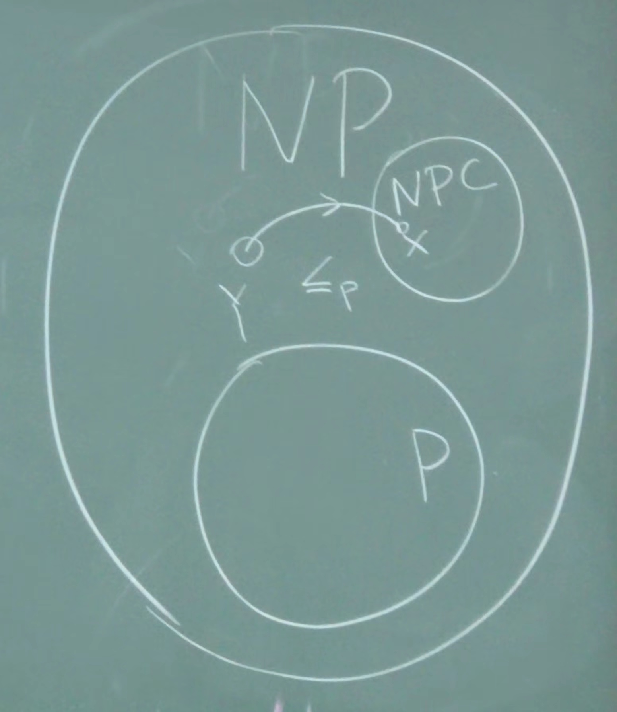

# Continue the Dynamic Programming

## Maximum independent set on a node-weighted tree

- Store two values for each node: when choose or not choose the node, the maximum independent set size of the subtree rooted at the node.
- Independent set on general graphs $\in$ NP-hard.

## Tree decomposition and tree-width

- Def: $T$: each node $t\in T$ corresponds to a bag $V_t\subseteq V$.
  1. (node coverage) Each node in $G$ belongs to some bag.
  2. (edge coverage) Each edge in $G$ belongs to some bag.
  3. (coherence) $t_1, t_2, t_3 \in T$, $t_2$ lies on $t_1\to t_3$ path, if $v\in V_{t_1}$ and $v\in V_{t_3}$, then $v\in V_{t_2}$.
- Tree decomposition is not unique.
- Tree-width of a tree decomposition:
  $$t_w(T) = \max_{t\in T} |V_t| - 1$$
- Tree-width of a graph:
  $$t_w(G) = \min_{T} t_w(T)$$

- LM: A graph with $t_w=1$ is a tree.
- LM (separator): Suppose $T-t$ has components $T_1, T_2, \ldots, T_d$, then $G_{T_1}-V_t$ and $G_{T_2}-V_t$ have no node in common and no edge between them.

- LM (edge separator): Suppose $t_1, t_2 \in T$ are two adjacent bags, then deleting $V_{t_1}\cap V_{t_2}$ disconnects $G$ into $\ge 2$ components.

- Max independent set on graphs with $O(1)$ $t_w$.
- We are interested in graphs with constant tree-width, $t_w(G) = O(1)$.
- Fact
  1. Find min $t_w$ $\in$ NP-hard.
  2. If $t_w(G) = O(1)$, there is a $2^{O(t_w)}n$ algorithm to find the tree decomposition with min $t_w$.
- Idea: DP on tree decomposition $T$.
  - $f_t(U) = w(S)$ where $S$ is the maximum independent set in $G_{t}$ s.t. $S\cap V_t = U$.
    - $t\in T$
    - $U\subseteq V_t$
  - LM: Let $S_i = S\cap G_{t_1}$, $S_i$ is the maximum weight independent set in $G_{t_1}$ s.t.
    $$S_i\cap V_t = U\cap V_{t_i}$$
    $$f_t(U) = w(U) + \sum_{i=1}^d \max_{U_i \text{ satisfies above and }U_i \text{ is ind set in } V_{t_i}}[f_{t_i}(U_i)-w(U_i\cap U)]$$

## NP-Completeness

- Def (polynomial reduction): If a problem $Y$ can be solved in poly-time plus a poly-time call to an oracle that solves problem $X$, we say $Y$ is poly-time reducible to $X$.
  $$Y\le_p X$$

- Prop: Suppose $Y\le_p X$.
  1. If $X$ is poly-time solvable, so is $Y$.
  2. If $Y$ is not poly-time solvable, neither is $X$.

### Definition

- Def P: The class of problem $X$ for which there is a poly-time algorithm to solve $X$.
- Def NP: The class of problem $X$ for which there is a poly-time algorithm to ***certifier*** a solution.

### Decision problems

- E.g.1
  - IS: whether $\exists$ IS of size $\ge k$.
  - VC: whether $\exists$ VC of size $\le k$. (vertex cover)
  - Using IS as a oracle, just ask whether $\exists$ IS of size $\ge n-k$.
  - Since the complement of IS is VC, we have
    $$VC\le_p IS$$
  - Similarly, we have
    $$IS\le_p VC$$
  - Set cover: $U$: a set of elements $S_1, S_2, ..., S_m \subseteq U$, whether there is a collection $C$ of $\le k$ subsets s.t.
    $$\cup_{S_i\in C} S_i = U$$
    $$VC\le_p SC$$
