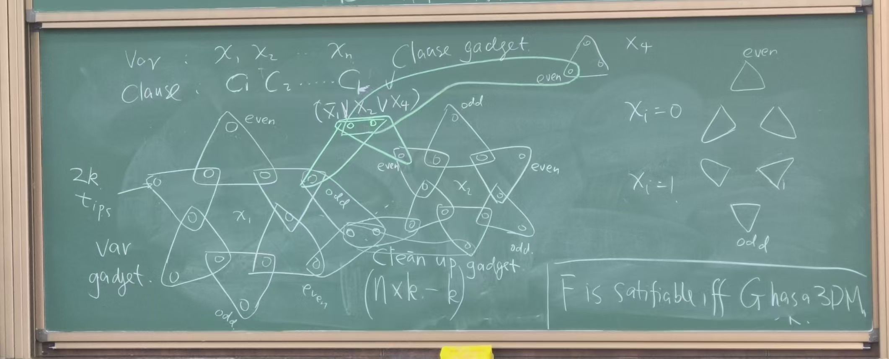

# NP-Complete

- We only focus on decision problems.
- We can think a decision problem $X$ as a set (infinite) of strings.
  - A string $s\in X$ if $S$ is a "yes" instance of the problem.
  - $A(s) = \text{yes}$ iff $s\in X$. $A$ runs in polynomial time.
- Def: efficient (poly time) certifier. We say $B$ is an efficient certifier if
  - $B(s, t)$ runs in poly time. (in $|S|$ and $|t|$)
    - $s$ is an instance of $X$.
    - $t$ is a certificate.
  - $s\in X$ iff $\exists t$, $|t|\le \text{poly}(|S|)$ and $B(s, t) = \text{yes}$.
- Prop: $P\subseteq NP$.
  - Open problem: $P=NP$?
- Def: NP-Complete. We say a problem $X$ is NPC if
  - $X\in NP$.
  - $\forall Y\in NP$, $Y\le_p X$.

- Cook/Levin 1971: the first NPC problem SAT.
  - Circuit-SAT: given a circuit, is there an input that makes the output 1?
  
  - Proof (sketch/informal)
    - We want to show for any $Y\in NP$, $Y\le_p SAT$.
    - Since $Y\in NP$, we assume $B$ is an efficient certifier for $Y$.
    - Expand $B$ to a poly-size circuit. Input $s$ and $t$, output 1 if $B(s, t) = \text{yes}$.
    - We want to use SAT oracle to solve $Y$.

- Prop: if $Y\in NPC$, and $Y\le_p X$, then $X\in NPC$.
  - Proof: For any $Z\in NP$, $Z\le_p Y$, so $Z\le_p X$.
  - Because $\le_p$ is transitive.

## NPC Problems

- Lemma: 3-SAT is NPC.
  - 3-CNF: conjunctive normal form with 3 literals per clause.

- Thm: Independent set (IS) is NPC.
  - Proof
    - $IS\in NP$.
    - We want to show $3SAT\le_p IS$.
    - Given a 3-CNF formula $F$, we will construct an IS instance $I$ s.t. $F$ is satisfiable iff $I$ has an IS of size $\ge k$.
    - e.g. $F = (x_1\lor \lnot x_2\lor x_3)\land(\lnot x_1\lor x_2\lor x_3)\land(\lnot x_1\lor x_2\lor \lnot x_3)$.
    
    - Claim: $F$ is satisfiable iff $I$ has an IS of size $\ge k$.
- Thm: Hamiltonian cycle (HC) is NPC.
  - Proof
    - $HC\in NP$.
    - We want to show $3SAT\le_p HC$.
    - $F$ is satisfiable iff $G$ has a HC.
    
- Thm: 3-dimensional matching (3DM) is NPC.
  - 3DM
    - $\exists$ subset of 3-edges s.t. each vertex is matched exactly once.
    
  - Proof
    - $3DM\in NP$.
    - We want to show $3SAT\le_p 3DM$.
    
- Thm: Clique is NPC. $IS\le_p Clique$.
- Thm: VC is NPC. $IS\le_p VC$.
- Thm: SC is NPC. $VC\le_p SC$.
- Thm: 3-coloring is NPC.
- Thm: Subset sum problem is NPC.
  - Subset sum
    - Given a set of positive integers $S$ and a target $t$, $\exists$ subset of $S$ s.t. sum is $t$.
  - Proof
    - $3DM\le_p \text{Subset sum}$.
