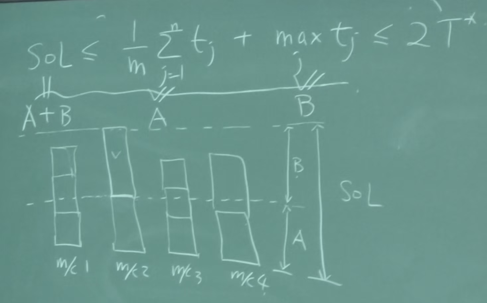

# FPT and Approximation Algorithms

- Independent Set (NP-hard in general)
- Independent Set (Poly time)
  - on trees (DP)
  - on graphs with $t(w) = O(1)$ (DP)
  - on bipartite graph (matching)
  - on interval graph (unweighted: greedy, weighted: DP)

## FPT (fixed parameter tractable)

- running time $O(f(k) \cdot \text{poly}(n))$

$$
    \begin{cases}
        n^k & \text{not FPT} \\
        2^k \cdot n & \text{FPT}
    \end{cases}
$$

- Vertex Cover (NP-hard)
  - parameter: size of vertex cover
  - naive algo:
    $${n \choose k} \text{poly}(n) \sim n^{k+O(1)} \quad \text{not FPT}$$
  - Ob: suppose $e=(u, v)$ is an edge, then $VC(G) \le k$ iff
    $$
        \begin{cases}
            VC(G-u) \le k-1 \\
            VC(G-v) \le k-1
        \end{cases}
    $$
  - Algo: check $(G, k)$, check whether $VC(G) \le k$

    ```c
    if G has no edge and k >= 0 return yes
    if |E(G)| > k|V| return no
    else
        pick an arbitrary edge e=(u, v)
        return check(G-u, k-1) or check(G-v, k-1)
    ```

    running time:
    $$T(n, k) \le 2T(n-1, k-1) + cnk$$
    $$T(n, k) \le nk \cdot 2^{k+1}$$

## Approximation Algorithms (poly-time, quality of solution)

- Approximation ratio / factor ($\alpha \ge 1$)
  $$
    \begin{cases}
        \text{min} & \sup_I \frac{\operatorname{SOL}(I)}{\operatorname{OPT}(I)} \\
        \text{max} & \sup_I \frac{\operatorname{OPT}(I)}{\operatorname{SOL}(I)}
    \end{cases}
  $$
  I: instances
- PTAs (poly-time approx scheme)
  - $\alpha = 1$ (exact)
  - $\alpha = 1 + \epsilon$ (approx)($\epsilon > 0$ is a fixed constant)
    - running time $O(n^{\frac{1}{\epsilon}})$, $O(n\frac{1}{\epsilon^2})$.

### Load Balancing Problem

- $n$ jobs (job $j$ has processing time $t_j$)
- $m$ machines $M_1, M_2, \cdots, M_m$.
- load of machines $M_i$
  $$T_i = \sum_{j \text{ assigned to } M_i} t_j$$
- Goal: minimize the makespan
  $$\max_i T_i$$
- NP-hard
- Greedy Algorithm: process jobs one by one, assign the job to the machine with min load
- Analysis: OPT: $T^*$
  - Ob 1: $T^* \ge \frac{1}{m} \sum_{j=1}^n t_j$
  - Ob 2: $T^* \ge \max_j t_j$
  - $$\text{SOL} = \frac{1}{m} \sum_{j=1}^n t_j + \max_j t_j \le 2T^*$$
    
- The analysis is tight.
  
- Improved Approx ratio for load balancing
  - THM: (sorted) Greedy Algo achieves an approx ratio of 1.5.
  - Proof
  - Assume in SOL, $M_i$ has largest load.
    - In $M_i$, if there is one job, $B = \max_j t_j = T^*$.
    - In $M_i$, if there are $>1$ jobs, $\text{SOL} = A + B$.
    - Since $B$ is placed later, $B \le T_i /2$.

### $k$-Center Problem

- Given a metric graph $G(V, E)$
- Choose $k$ vertices (centers).
- Goal: minimize $\max_{v \in V} d(v, C)$
  - $C$: set of centers
  - $d(v, C) = \min_{c \in C} d(v, c)$
- Metric:
  - $d(u, v) \ge 0$
  - $d(u, v) = d(v, u)$
  - $d(u, v) + d(v, w) \ge d(u, w)$
- THM: The algorithm achieves an approx ratio of 2.
- Algo:

  ```c
  Guess the optimal solution r (there are at most |E| guesses)
  S = G, C = {}
  while S is not empty
      choose an arbitrary v in S
      C = C + v
      delete all nodes u s.t. d(u, v) <= 2r
  if |c| <= k succeed else guess r too small
  ```

- Claim: if our guess is correct ($r \ge \text{OPT}$), the above algo will succeed.
  - There must exist a center $c$ in optimal solution within distance $r$ from $v$.
  - So the cluster of $c$ is within distance $2r$ from $v$.
  - The cluster will be deleted.

### Knapsack

- $n$ items, item $i$ has weight $w_i$ and value $v_i$.
- A knapsack of capacity $W$.
- Goal: maximize the total value of items in the knapsack.
- Discretize the value.
  $$\overline{v_i} = \lceil \frac{v_i}{b} \rceil b, \quad \hat{v_i} = \lceil \frac{v_i}{b} \rceil$$
- DP: $OPT(i, V)$: Smallest weight one can obtain using items from 1 to $i$ with total value $\ge V$.
  $$OPT(i, V) = \min \{OPT(i-1, V), w_i + OPT(i-1, V-\hat{v_i})\}$$
- Our solution is $S$, and optimal solution is $S^*$.
- THM:
  $$(1+\epsilon)\sum_{i\in S}v_i\geq \sum_{i\in S^*}v_i$$
- Proof:
  $$\sum_{i\in S}\hat{v_i}\geq \sum_{i\in S^*}\hat{v_i}$$
  $$\sum_{i\in S^*}{v_i}\leq \sum_{i\in S^*}\overline{v_i}\leq b\cdot \sum_{i\in S}\hat{v_i}\leq \sum_{i\in S}(v_i+b)\leq \sum_{i\in S}v_i+n\cdot \frac{\epsilon}{2n}\max_jv_j$$
