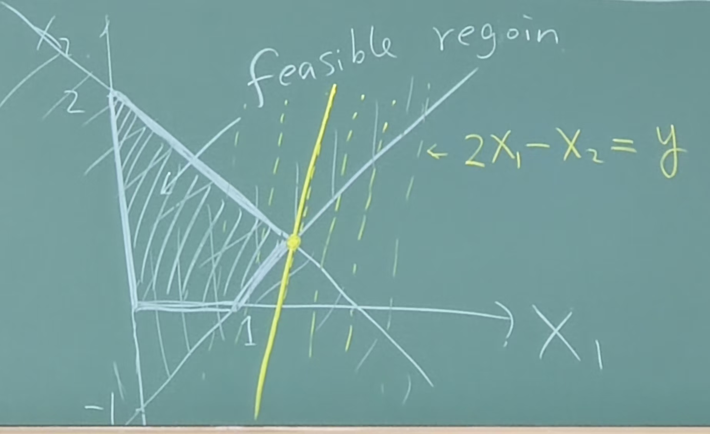

# Approximation Continue

## Set Cover

- $U$: a set of elements.
- $s_1, s_2, ..., s_n \subseteq U$ are subsets.
- $s_i$: $w_i$: the weight of $s_i$.
- A set cover is a collection of subsets $C \subseteq \{s_1, s_2, ..., s_n\}$ such that $\bigcup_{s_i \in C} s_i = U$.
- Goal: find a set cover $C$ with minimum total weight.
- Greedy
  - cost effectiveness of $s_i = w_i / \text{\# elements}$.
  - repeat: pick $s_i$ with the best cost effectiveness until $U$ is covered.
- Analysis
  - Suppose $s_{i_1}, s_{i_2}, ..., s_{i_k}$ are the sets picked by the greedy algorithm.
  - \# elements newly covered: $m_1, m_2, ..., m_k$.
  - \# elements remained: $n_1 = n-m_1, n_2 = n - m_1 - m_2, ..., n_k$.
  - Claim:
    $$\frac{w_{i_{t+1}}}{m_{i_{t+1}}} \le \frac{\text{OPT}}{n_t}$$
  - Proof
    $$
    \begin{aligned}
        \text{SOL} &= \sum_{t=1}^k w_{i_t} \le \sum_{t=1}^k \frac{\text{OPT}}{n_{t-1}} m_{i_t} \le \text{OPT} \sum_{t=1}^k \frac{m_{i_t}}{n_{t-1}} \\
        &\le \text{OPT} (\frac{1}{n} + \frac{1}{n-1} + ... + \frac{1}{1}) \\
        &\le \text{OPT}\cdot H_n
    \end{aligned}
    $$
  - Note: it is NP-hard to approx SC within a factor of $0.999999\log n$.

## Linear Programming

- Minimize/maximize: $\sum_{i=1}^n c_i x_i$. (objective, linear)
- Subject to: $\sum_{j=1}^n a_{ij} x_j \le b_i$ or $\ge b_i$ for $i = 1, 2, ..., m$. (constraints, linear)
  $$\text{min/max} \quad C^T x \quad \text{s.t.} \quad Ax \le b$$
- Feasible region:
  
- Each constraints is a half-space.
- $\{x\mid Ax\le b\}$ is the intersection (polyhedron) of several half-spaces.
- LP has **vertex optimal solution**.
- Each vertex corresponds to a subsystem of linear equations. (in general, in $R^d$, a vertex is intersection of $d$ hyperplanes)
- Algorithm for LP: Simplex algorithm (Danzig)
  - Start from a vertex.
  - Move to a neighboring vertex that improves the objective.
  - Repeat until no improvement.
- OPEN: poly-time Simplex-algo.

## Vertex Cover (LP relaxation & Rounding)

- 2-approximation
- LP relaxation & Rounding
  - write an LP-relaxation for VC.
    - $x_i$: whether we choose $v_i$, $x_i\in \{0, 1\}$.
    - $\min \sum_i w_ix_i$
    - s.t. $x_i + x_j \ge 1$ for each edge $(v_i, v_j)$.
    - LP-relaxation: $0 \le x_i \le 1$. (more easy to solve than the case $x_i\in \{0, 1\}$).
  - OPT(VC) = OPT(ILP) $\le$ OPT(LPR).
    - since LPR can take more values than ILP(0, 1).
  - Rounding
    - we solve LPR and get fractional solution $\widetilde{X}$.
    - rounding:
      $$\overline{x_i} = \begin{cases} 1 & \text{if } \widetilde{x}_i \ge 0.5 \\ 0 & \text{otherwise} \end{cases}$$
  - Analysis
    1. Feasibility: $\overline{X}$ is a vertex cover, because for each edge $(v_i, v_j)$, $\widetilde{x}_i + \widetilde{x}_j \ge 1$. So at least one of $\overline{x}_i, \overline{x}_j$ is 1.
    2. $$\text{SOL} = \sum_i w_i\overline{x}_i \le \sum_i w_i(2\widetilde{x}_i) = 2 \sum_i w_i\widetilde{x}_i = 2 \text{OPT}$$
  - Note: It is VCG-hard to achieve anything better than 2.

## Set Cover (LP relaxation & Rounding)

- LP relaxation & Rounding
  - write an LP-relaxation for SC.
    - $x_i$: whether we choose $s_i$, $x_i\in \{0, 1\}$.
    - $\min \sum_i w_ix_i$
    - s.t. $\sum_{s_i \in S} x_i \ge 1$ for each element $e \in U$.
    - LP-relaxation: $0 \le x_i \le 1$.
  - OPT(SC) = OPT(ILP) $\le$ OPT(LPR).
  - Rounding
    - we solve LPR and get fractional solution $\widetilde{X}$.
    - rounding:
      $$
      \overline{x_i} = \begin{cases}
      1 & \text{w.p.} \quad \widetilde{x}_i \\
      0 & \text{w.p.} \quad 1 - \widetilde{x}_i
      \end{cases}
      $$
  - Analysis
    - First bound $\operatorname{Pr}[\text{the solution is feasible}]$.
    - Consider an element $e \in U$.
      - $\operatorname{Pr}[e \text{ is not covered}] = \prod_{s_i \ni e} (1 - \widetilde{x}_i) \le e^{-\sum_{s_i \ni e} \widetilde{x}_i} \le e^{-1}$.
    - Repeat the rounding $2\log n$ times and union the solutions.
      - $\operatorname{Pr}[e \text{ is not covered}] \le 1 / n^2$.
      - $\operatorname{Pr}[\text{the solution is feasible}] \ge 1 - 1/n$. (by union bound)
    - $$\mathbb{E}[\text{SOL}] \le 2\log n\cdot \mathbb{E}[\text{cost of 1 round}] \le 2\log n \sum_i s_i\widetilde{x}_i \le 2\log n\cdot\text{OPT}$$

## Max-Cut Problem

- Given a graph $G = (V, E)$.
- A cut: partition $V$ into two sets $S, V-S$.
- The size of the cut: the number of edges between $S$ and $V-S$.
- 2-approximate
- A randomized algo: for each $v$, assign $v$ to $S$ with probability $1/2$.
- Analysis
  $$
  \begin{aligned}
  \mathbb{E}[\text{SOL}] &= \sum_{e\in E} \operatorname{Pr}[\text{e crosses the cut}] \\
  &= \sum_{e\in E} 0.5 = 0.5|E| \ge 0.5 \cdot \text{OPT}
  \end{aligned}
  $$

## TSP

- Cycle visit every vertex exactly once, minimize the total length. (**metric**)
- 2-approx: $MST \le OPT$ (min-span-tree)
  1. Double the MST.
  2. Traverse the tour by short-cutting.
