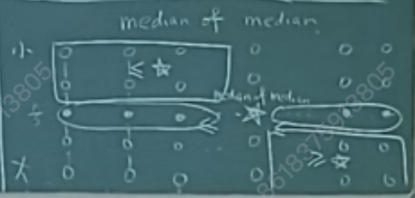

# Divide & Conquer

## Merge Sort

```
sort(s, t):
    list1 <- sort(s, (s+t)/2)
    list2 <- sort((s+t)/2, t)
    list  <- merge(list1, list2)
    return list
```

- Used to count \# of inversions in $O(n\log n)$ time.
- Analysis of running time
  - $T(n)$: time for seq of len $n$.
  - $T(n) \le 2T(n/2) + c\cdot n \implies T(n) = 2T(n/2) + O(n)$
  - Guess: $T(n) \le c\cdot n\log n$
    $$T(n) \le 2c\cdot (\frac{n}{2})\log(\frac{n}{2}) + c\cdot n = c\cdot n\log n - c\cdot n + c\cdot n = c\cdot n\log n$$
    - correct.
  - Master THM
    $$
    T(n) = \begin{cases}
        \Theta(1) & \text{if } n \le c \\
        aT(n/b) + f(n) & \text{otherwise}
    \end{cases}
    $$

## Closest Pair Problem (2D)

- $O(n\log n)$: Shames & Hoey
- $O(n)$: randomized

  

- Preprocessing: sort all points by $x$ and $y$ coordinates.

```
CL:
    d1 <- CL(S1)
    d2 <- CL(S2)
    b  <- min(d1, d2)
    sort all points in 2b by y-coordinates
    find all points within b of the middle line
```

- Let $\delta = \frac{\sqrt{2}}{2} b$.
- Key ob: each cell containing $\le 1$ point.

## Median Selection

- Select the $k$-th elements in $O(n)$ time.
- Algorithm, Select(S, k)
  - Choose a random pivot element $a_i\in S$.
  - Form $S^+$ and $S^-$.
    $$S^+ = \{a_j\in S\mid a_j > a_i\},\quad S^- = \{a_j\in S\mid a_j < a_i\}$$
  - if |S^-| = $k-1$, return $a_i$.
  - if |S^-| > $k-1$, return Select($S^-$, $k$).
  - else return Select($S^+$, $k-|S^-|-1$).
- Analysis of time (expected)
  - $|S^+|, |S^-| \ge \frac{1}{4}n$: succeed.
  - Expected time:
    $$E[\text{time}] = \sum_{i=1}^{O(\log n)} E[\text{time in $i$-th level}] = \sum_{i=1}^{O(\log n)} (\frac{3}{4})^i O(n) = O(n)$$
- True linear time: Blum, Floyd, Pratt, Rivest, Tarjan
  - divide $n$ elements into $n/5$ groups of 5 elements each.
  - sort each group and pick the median of each group.
  - recursively find the median of the medians.
  - choose it as the pivot.
  
  $$T(n) = c\cdot n + T(n/5) + T(7n/10)$$

## Fast Fourier Transform (FFT) and Convolution

- Convolution
  - input: $A = (a_0, a_1, \cdots, a_{n-1})$ and $B = (b_0, b_1, \cdots, b_{n-1})$
  - output: $C = (c_0, c_1, \cdots, c_{2n-2})$ where $c_k = \sum_{i+j=k} a_i\cdot b_j$
  - $C = A * B$.
  - Goal: $O(n\log n)$ time.
- Polynomial multiplication
  - $A(x) = a_0 + a_1x + \cdots + a_{n-1}x^{n-1}$
  - $B(x) = b_0 + b_1x + \cdots + b_{n-1}x^{n-1}$
  - $C(x) = A(x)\cdot B(x)$
  - $C(x) = c_0 + c_1x + \cdots + c_{2n-2}x^{2n-2}$
  - $c_k = \sum_{i+j=k} a_i\cdot b_j$
  - $c = a * b$.
- $O(n\log n)$ algo for polynomial multiplication
  - $n = 2^k$ for some $k\in \mathbb{Z}$, $2n$ points $x_1, x_2, \cdots, x_{2n}$ on the unit circle.
  - $\omega_{j, k} = e^{2\pi i j/k}$.
  1. Compute $A(x_1), A(x_2), \cdots, A(x_{2n})$ and $B(x_1), B(x_2), \cdots, B(x_{2n})$.
  2. $C(x_j) = A(x_j)\cdot B(x_j)$.
  3. Reconstruct $C$ from $C(x_1), C(x_2), \cdots, C(x_{2n})$.
  - Step 1 is essentially Discrete FT (DFT).
    - $A_{\text{even}} = a_0 + a_2 x + \cdots + a_{n-2}x^{(n-2)/2}$
    - $A_{\text{odd}} = a_1 + a_3 x + \cdots + a_{n-1}x^{(n-1)/2}$
    - $A(x) = A_{\text{even}}(x^2) + x\cdot A_{\text{odd}}(x^2)$
    - $x_i = \omega_{i, 2n}$
    - $A(x_i) = A_{\text{even}}(x_i^2) + x_i\cdot A_{\text{odd}}(x_i^2)$
    - $A(x_{i+n}) = A_{\text{even}}(x_i^2) - x_i\cdot A_{\text{odd}}(x_i^2)$
  - Step 2 is Pointwise multiplication.
  - Step 3 is Inverse FT (IFT).